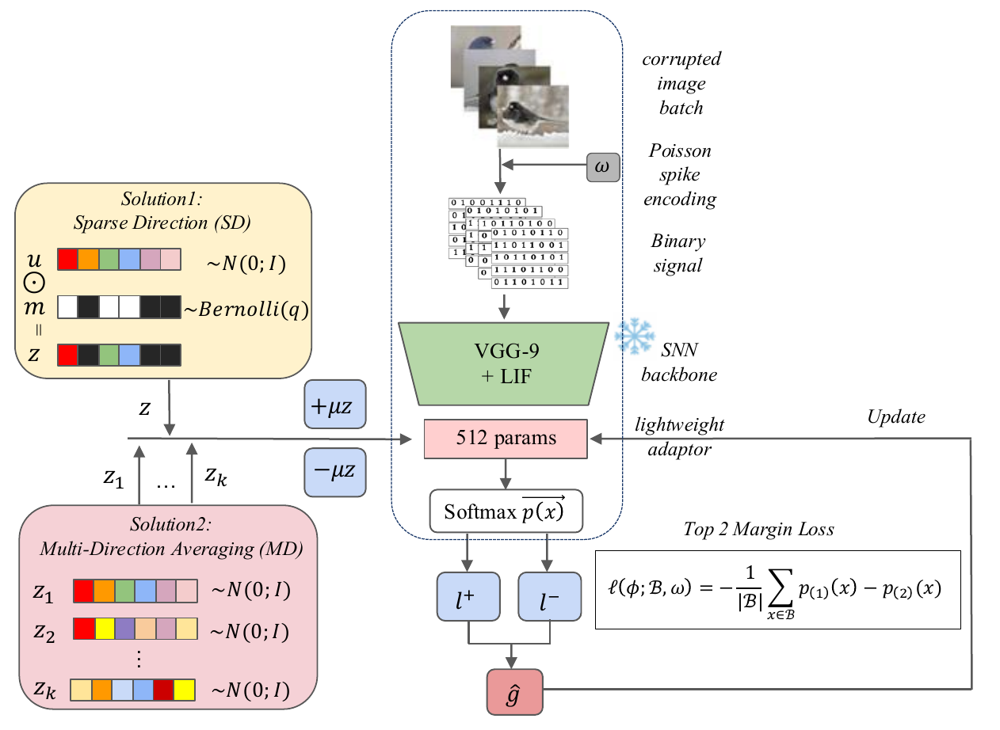

<div align="center">

# VC-SZO

### Forward-Only Test-Time Adaptation for Spiking Neural Networks

Ruoyu Zhao · Yuting Chen · Jiaqi Wu · Luziwei Leng

**Accepted at the NeurIPS 2026 Workshop on On-Device Intelligence (Poster)**

<a href="#citation"></a>
<a href="#coming-soon"></a>
<a href="LICENSE"></a>


</div>

VC-SZO adapts a pretrained spiking neural network at test time using **forward evaluations only**. It freezes the backbone and updates a 512-parameter channel adapter with symmetric zeroth-order probes, shared spike-encoding randomness, and explicit variance control.

<p align="center">
  
</p>

## Highlights

- **Backward-free online adaptation.** Sparse-direction (SD) and multi-direction (MD) updates require no surrogate gradient or temporal activation graph.
- **Auditable deployment trade-off.** SD uses a conservative two-probe update; MD spends additional forward queries to reduce direction-sampling variance.
- **Honest held-out result.** VC-SZO preserves frozen-model accuracy in the tested CIFAR-10-C streams; it does not claim a statistically clear gain over the strong Source model.
- **Low peak memory.** The reported audit uses 17× less peak memory than full-graph TENT and 127× less than augmentation-based MEMO.

## Quick start

```bash
git clone https://github.com/THUROI0787/VC-SZO.git
cd VC-SZO
conda create -n vcszo python=3.11 -y
conda activate vcszo
pip install -r requirements.txt
git lfs pull
python scripts/smoke_test.py
```

Download the official [CIFAR-10-C archive](https://zenodo.org/records/2535967) and extract it to `data/CIFAR-10-C/`.

## Run the paper protocol

The main configuration uses BNTT-VGG9, `T=12`, batch size 2, severity 5, 120 images per corruption, and all 15 CIFAR-10-C corruptions.

```bash
GPU=0 DATA_ROOT=data bash scripts/run_main_snn.sh
```

A small end-to-end check:

```bash
python experiments/run_snn.py \
  --gpu 0 --tag smoke --T 12 --levels 5 --batches 2 --seeds 42 \
  --methods source,vcszo_sd,vcszo_md --corruptions defocus_blur \
  --max-samples 8 --data-root data
```

Results are written atomically under `outputs/`, which is ignored by Git.

## Checkpoints

| Horizon | Clean accuracy | Checkpoint |
|---:|---:|---|
| 4 | 86.47% | `checkpoints/snn/vgg9_t4_best.pt` |
| 6 | 87.62% | `checkpoints/snn/vgg9_t6_best.pt` |
| 12 | 89.39% | `checkpoints/snn/vgg9_t12_best.pt` |
| 25 | 89.81% | `checkpoints/snn/vgg9_t25_best.pt` |

Exact byte sizes and SHA-256 hashes are recorded in [`checkpoints/manifest.json`](checkpoints/manifest.json).

## Reproducibility and scope

- Each batch is predicted before its online update; labels are never used for adaptation.
- Positive and negative probes reuse the same Poisson encoding randomness.
- The dense-ZO ablation is query-matched, not matched for perturbation energy or empirical update norm.
- Dataset files and generated outputs are not distributed in this repository.

See [`REPRODUCIBILITY.md`](REPRODUCIBILITY.md) for the fixed protocol, method identifiers, evidence boundary, and compute accounting.

## Citation

The camera-ready paper and proceedings citation are **coming soon**. Machine-readable author metadata is available in [`CITATION.cff`](CITATION.cff).

<a id="coming-soon"></a>
The project page will be linked here when it is public.

## License

Released under the [MIT License](LICENSE).
